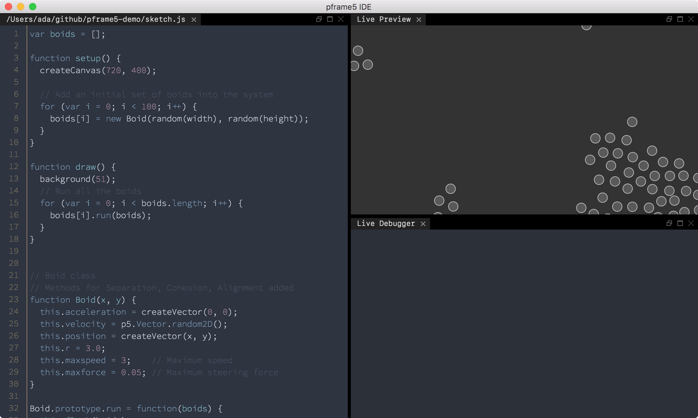

# pframe5-ide
> pronounced 'frames'

**pframe5** is an environment for creative coding, sharing, remixing, and learning using, primarily, [p5.js](https://p5js.org).

## DISCLAIMER
**pframe5-ide is not yet usable.**

This project is in -very- early development. You probably shouldn't even be reading this.

## Installation
Clone the repo, navigate to it in terminal, and then:
`$ npm install`

## Project Structure
The only file you should edit in the `app` directory is the `app.html` file. Everything else is auto-generated by the build process

## Configuration
All configuration is done in-code at the moment as this really isn't even a usable product yet. `pframe5` will look in a `PROJECT_DIRECTORY` as identified in [https://github.com/8-uh/pframe5-ide/blob/master/src/index.js](https://github.com/8-uh/pframe5-ide/blob/master/src/index.js) for a `sketch.js` file. I suggest using the p5.js example project (included in the [p5.js complete download](https://github.com/processing/p5.js/releases/download/0.5.7/p5.zip)) as the target `PROJECT_DIRECTORY`

This will change when project management is properly implemented

## Running
`$ npm start`

## Preview Window
The preview window loads an electron `<webview>` and runs a local static express server pointing at your `PROJECT_DIRECTORY` so that A) You can load and manipulat image assets and B) so that an error or infinite loop in the sketch code does not break the IDE

## TODO
Oh god... So many things... Will list later

## Current Objectives
* ~~Implement keyboard shortcut registration via configuration file~~
* ~~Communicate shortcut commands to front end via RPC~~
* Capture and Route shortcut commands to proper components
* Implement Chrome Debugger Protocol to allow the IDE to connect to the preview's web view and allow all the goodness that comes with a -real- debugger to be available
